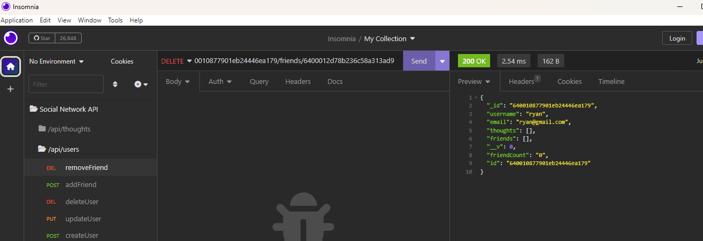

# Social Network API

## Description

The motivation for this project was to explore using Express.js, MongoDB, and the Mongoose ODM to create a back-end for a Social Network API. By building this project, I further solidified my knowledge of using Mongoose and Express to interface with a MongoDB database. 

## Table of Contents

- [Installation](#installation)
- [Usage](#usage)
- [License](#license)
- [Contributing](contributing)
- [Questions](#questions)

## Installation

This project uses the node modules:
- express ^4.17.1
- mongoose ^6.0.13
- nodemon ^2.0.9

Run the command 'npm i' to install Node Package Manager, along with the above node modules.

To seed the database, use the command 'npm run seed'. The seed data and js files can be found in the 'utils' directory.

Run "npm run dev" to run the application in developer mode with nodemon, or "npm run start" to start the application using node.

## Usage

Once running and seeded with data, the server listens to requests through port 3001. Insomnia is a lightweight application that can be used to query the server. 

The application contains two Models, Thought and User, and an additional Schema, Reaction, for managing user's replies to posted thoughts. The user is provided with seven routes for interacting with each of the models including: 
- Get all users/thoughts
- Get a single user/thought
- Create a new user/thought
- Update a user/thought
- Delete a user/thought
- Add a friend to a user's friend's list/ Add a reaction a thought
- Remove a friend from a user's friend's list/ Remove a reaction from a thought

The screenshots below show example requests and responses for querying the User collection in the database:

'GET /api/users' pulls all users and shows their thoughts by id, their friends by id, their username, email, friend count, and database id.

'GET /api/users:userId' pulls a single user by the provided userId and shows their associated thoughts and friends by id.

'POST /api/users' creates a new user, requiring a unique username and a unique/valid email.

'PUT /api/users/:userId' updates the user with the corresponding 'userId' with the data in the request body.

'DELETE /api/users/:userId' deletes the corresponding user from the database, along with their associated thoughts.

'POST /api/users/:userId/friends/:friendId' adds the friend (user with corresponding friendId) to the user's (... with corresponding userId) friend's list.

'DELETE /api/users/:userId/friends/:friendId' removes the corresponding friend from the corresponding user's friend's list.

Routes for the Thoughts Model and Reaction Schema function similarly to the examples above. A demo for those routes can be found in the video demo that is linked in the Questions section.

## License

n/a

## Contributing

n/a

## Questions

A video demo of the project can be [viewed here](https://drive.google.com/file/d/11Cuo-cbzKgj5b32bSlwNfubptig_2LK_/view?usp=share_link).

If you have any questions about the repo, open an issue or contact me directly at ryanfernandez11@gmail.com. You can find more of my work at [my GitHub page](https://github.com/ryanafernandez/).